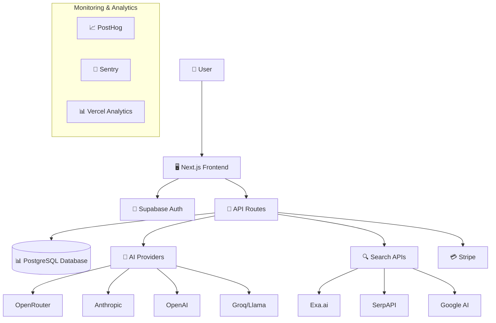
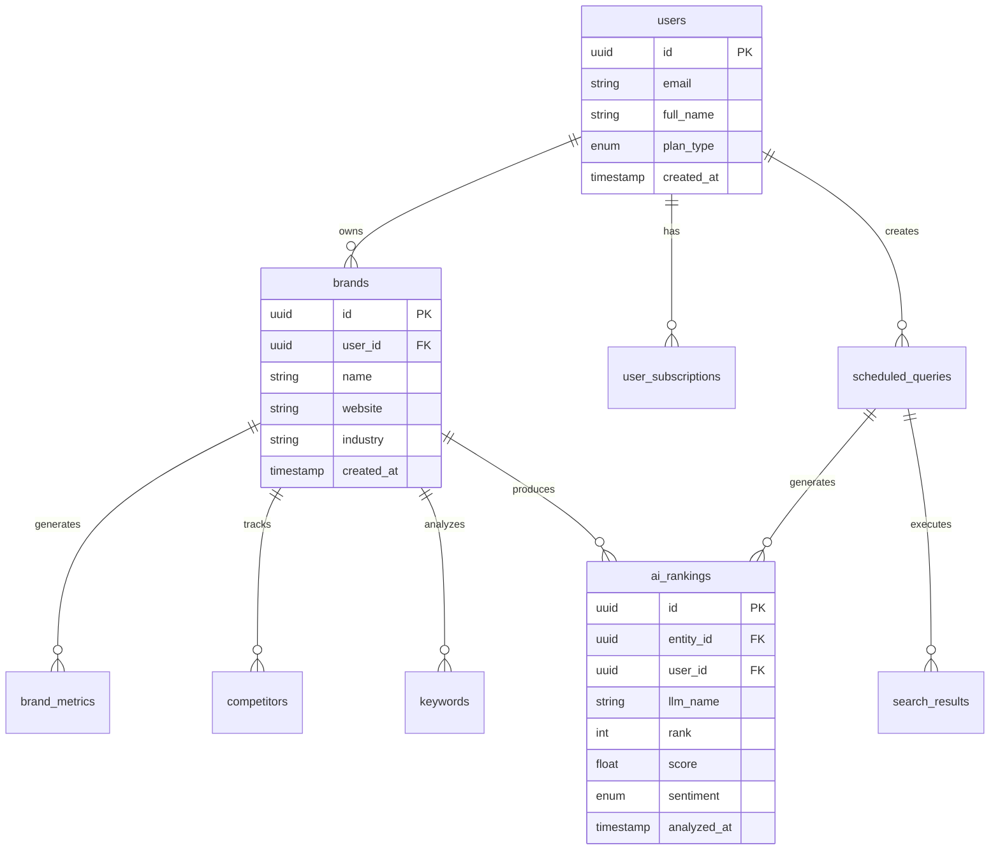
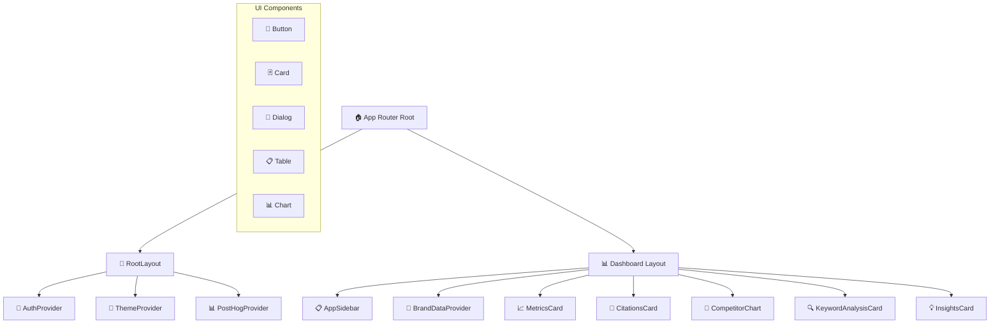

# 🚀 Brand Scope - Technical Documentation

<p align="center">
  
</p>

<div align="center">

**BrandScope**: AI-Powered Brand Insights & AI Search Engine Analytics Platform  
*A personal project showcasing modern full-stack development with AI integration*

[](https://nextjs.org/)
[](https://www.typescriptlang.org/)
[](https://supabase.com/)
[](https://stripe.com/)
[](https://github.com)
[](https://github.com)

</div>

---

## 📚 Table of Contents

<details>
<summary>Click to expand full table of contents</summary>

- [🚀 Brand Scope - Technical Documentation](#-brand-scope---technical-documentation)
  - [📚 Table of Contents](#-table-of-contents)
  - [🎯 Project Overview](#-project-overview)
    - [Core Value Proposition](#core-value-proposition)
    - [Key Features Summary](#key-features-summary)
  - [🏗️ Technical Architecture](#️-technical-architecture)
    - [Technology Stack Overview](#technology-stack-overview)
    - [System Architecture Diagram](#system-architecture-diagram)
    - [Infrastructure Components](#infrastructure-components)
  - [📊 Core Features \& Functionality](#-core-features--functionality)
    - [1. Brand Analysis Engine](#1-brand-analysis-engine)
      - [Multi-AI Model Search](#multi-ai-model-search)
      - [Analysis Components](#analysis-components)
    - [2. Competitive Intelligence](#2-competitive-intelligence)
      - [Competitor Discovery](#competitor-discovery)
      - [Competitor Tracking](#competitor-tracking)
    - [3. Keyword \& Content Strategy](#3-keyword--content-strategy)
      - [Keyword Research](#keyword-research)
      - [Content Optimization](#content-optimization)
    - [4. Monitoring \& Automation](#4-monitoring--automation)
      - [Scheduled Queries](#scheduled-queries)
      - [Real-time Analysis](#real-time-analysis)
    - [5. Credit System \& Billing](#5-credit-system--billing)
      - [💳 Subscription Plans](#-subscription-plans)
      - [💵 Pay-as-you-Go Options](#-pay-as-you-go-options)
      - [📊 Credit Usage Features](#-credit-usage-features)
  - [🗃️ Database Schema \& Data Models](#️-database-schema--data-models)
    - [Core Tables Overview](#core-tables-overview)
    - [Relationship Diagram](#relationship-diagram)
    - [Core Tables](#core-tables)
      - [Users Table](#users-table)
      - [Brands Table](#brands-table)
      - [Brand Metrics Table](#brand-metrics-table)
      - [AI Rankings Table](#ai-rankings-table)
      - [Scheduled Queries Table](#scheduled-queries-table)
      - [Search Results Tables](#search-results-tables)
      - [User Subscriptions Table](#user-subscriptions-table)
  - [🔄 API Architecture \& Endpoints](#-api-architecture--endpoints)
    - [API Endpoints Reference](#api-endpoints-reference)
    - [Request/Response Patterns](#requestresponse-patterns)
      - [📤 Standard Request Format](#-standard-request-format)
      - [📥 Standard Response Format](#-standard-response-format)
      - [⚠️ Error Handling Matrix](#️-error-handling-matrix)
  - [🔍 AI Integration Details](#-ai-integration-details)
    - [Supported AI Models](#supported-ai-models)
      - [🔍 Explorer Mode Models (Cost-Effective Analysis)](#-explorer-mode-models-cost-effective-analysis)
      - [🚀 Voyager Mode Models (Advanced Analysis)](#-voyager-mode-models-advanced-analysis)
    - [Analysis Modes Comparison](#analysis-modes-comparison)
    - [Credit Cost Breakdown](#credit-cost-breakdown)
    - [AI Analysis Workflow](#ai-analysis-workflow)
      - [1. Query Processing](#1-query-processing)
      - [2. Response Analysis](#2-response-analysis)
      - [3. Competitive Comparison](#3-competitive-comparison)
  - [🎨 Component Architecture](#-component-architecture)
    - [Component Hierarchy](#component-hierarchy)
    - [Core Component Structure](#core-component-structure)
    - [State Management](#state-management)
      - [🔧 Context Providers](#-context-providers)
      - [🪝 Custom Hooks](#-custom-hooks)
  - [🔐 Security \& Authentication](#-security--authentication)
    - [Authentication Flow](#authentication-flow)
      - [Supabase Auth Integration](#supabase-auth-integration)
      - [Route Protection](#route-protection)
      - [Security Features](#security-features)
  - [📈 Monitoring \& Analytics](#-monitoring--analytics)
    - [Performance Monitoring](#performance-monitoring)
      - [Sentry Integration](#sentry-integration)
      - [PostHog Analytics](#posthog-analytics)
      - [Vercel Analytics](#vercel-analytics)
    - [Business Metrics](#business-metrics)
      - [Credit Usage Tracking](#credit-usage-tracking)
      - [Query Performance Metrics](#query-performance-metrics)
  - [🚀 Deployment \& DevOps](#-deployment--devops)
    - [Development Environment](#development-environment)
    - [Environment Configuration](#environment-configuration)
      - [Required Environment Variables](#required-environment-variables)
    - [Production Deployment](#production-deployment)
      - [Vercel Platform](#vercel-platform)
      - [Database Management](#database-management)
  - [🔧 Configuration \& Customization](#-configuration--customization)
    - [Theme Configuration](#theme-configuration)
    - [Feature Flags](#feature-flags)
    - [Credit System Configuration](#credit-system-configuration)
  - [📝 Development Guidelines](#-development-guidelines)
    - [📋 Code Standards](#-code-standards)
    - [🎯 Best Practices](#-best-practices)
    - [🧪 Testing Strategy](#-testing-strategy)
    - [📦 Development Workflow](#-development-workflow)
  - [� Project Status \& Monitoring](#-project-status--monitoring)
    - [📊 What's Being Monitored](#-whats-being-monitored)
    - [💾 Data Safety](#-data-safety)
    - [📚 Learning Resources](#-learning-resources)
  - [🎉 Quick Start Guide](#-quick-start-guide)
    - [🚀 For Developers](#-for-developers)
    - [📊 For Users/Testers](#-for-userstesters)
  - [🤝 Contributing](#-contributing)
    - [📋 Development Setup](#-development-setup)
    - [📞 Get In Touch](#-get-in-touch)

</details>

---

## 🎯 Project Overview

**Brand Scope** (BrandScope) is a sophisticated SaaS platform that provides comprehensive brand analysis and monitoring across AI search engines. The platform enables businesses to track their visibility, sentiment, and performance across multiple AI models including ChatGPT, Perplexity, Gemini, Claude, and others.

### Core Value Proposition

| 🎯 Feature | 📝 Description | 💡 Business Value |
|------------|----------------|-------------------|
| **AI SEO Optimization** | Monitor and improve brand visibility in AI-generated responses | Increase brand awareness in the AI-first search landscape |
| **Multi-AI Model Analysis** | Track performance across 15+ AI search engines and models | Comprehensive visibility across all major AI platforms |
| **Real-time Monitoring** | Scheduled queries with automated analysis and insights | Stay ahead of brand reputation changes |
| **Competitive Intelligence** | Compare brand performance against competitors | Identify market opportunities and threats |
| **Data-Driven Recommendations** | AI-powered suggestions for brand improvement | Actionable insights for marketing strategy |

### Key Features Summary

| 🚀 Category | 🔧 Features | 📊 Metrics |
|-------------|-------------|-------------|
| **Analysis Modes** | Explorer (5 models) + Voyager (10 models) | 15+ AI models supported |
| **Monitoring** | Scheduled queries (daily/weekly/monthly) | Up to 500 scheduled queries |
| **Credit System** | Subscription + Pay-as-you-go options | 150-27,000 credits available |
| **Integrations** | Stripe, Supabase, PostHog, Sentry | 10+ external services |
| **Data Sources** | AI models, Google Search, Reddit, Wikipedia | Multi-source intelligence |

---

## 🏗️ Technical Architecture

### Technology Stack Overview

| 🏷️ Category | 🛠️ Technology | 📋 Purpose | ⭐ Version |
|-------------|---------------|------------|-----------|
| **Frontend** | Next.js | React framework with App Router | 15.x |
| **Language** | TypeScript | Type-safe development | 5.x |
| **Styling** | TailwindCSS + shadcn/ui | Modern, responsive design | 4.x |
| **Animation** | Framer Motion | Smooth UI transitions | 12.x |
| **Database** | Supabase (PostgreSQL) | Authentication, data storage, real-time | Latest |
| **Payments** | Stripe | Subscription & PAYG billing | Latest |
| **Analytics** | PostHog + Sentry | User analytics & error monitoring | Latest |
| **Deployment** | Vercel | Hosting & CI/CD | Latest |

### System Architecture Diagram



### Infrastructure Components

| 🏗️ Component | 🎯 Responsibility | 🔧 Implementation |
|---------------|-------------------|-------------------|
| **Frontend Layer** | User interface, state management | Next.js 15 + React 19 |
| **API Layer** | Business logic, data processing | Next.js API routes |
| **Database Layer** | Data persistence, real-time updates | Supabase PostgreSQL |
| **AI Layer** | Multi-model AI analysis | 15+ AI provider integrations |
| **Payment Layer** | Billing, subscriptions, credits | Stripe integration |
| **Monitoring Layer** | Analytics, errors, performance | PostHog + Sentry + Vercel |

---

## 📊 Core Features & Functionality

### 1. Brand Analysis Engine

#### Multi-AI Model Search
- **Explorer Mode**: Cost-effective analysis using 5 AI models (1-3 credits per model)
  - Google AI Mode, Perplexity Sonar, Gemini 2.5 Flash, Claude 4.0 Sonnet, GPT-4o
- **Voyager Mode**: Comprehensive analysis using 10 advanced AI models (1 credit per model)
  - DeepSeek v3, Claude Sonnet 4, GPT-5, Llama 4 Maverick, Grok 4, and more

#### Analysis Components
- **Brand Visibility Scoring**: Algorithmic scoring based on AI model mentions
- **Sentiment Analysis**: Positive/Negative/Neutral sentiment classification
- **Ranking Analysis**: Position tracking across different AI responses
- **Consumer Perception**: AI-generated insights about brand perception
- **SWOT Analysis**: Automated strengths, weaknesses, opportunities analysis

### 2. Competitive Intelligence

#### Competitor Discovery
- **Automated Competitor Identification**: AI-powered competitor discovery
- **Industry Analysis**: Context-aware competitive landscape mapping
- **Ranking Differential**: Performance comparison metrics
- **Competitive Strengths/Weaknesses**: Detailed competitor analysis

#### Competitor Tracking
- **Multi-brand Monitoring**: Track multiple competitors simultaneously
- **Performance Benchmarking**: Relative performance metrics
- **Market Share Insights**: AI-estimated market positioning

### 3. Keyword & Content Strategy

#### Keyword Research
- **AI-Generated Keywords**: Industry-specific keyword discovery
- **Search Volume Estimation**: AI-predicted search volumes
- **Difficulty Scoring**: Ranking difficulty assessment (0-10 scale)
- **Opportunity Scoring**: Business opportunity evaluation
- **Relevance Rating**: Brand-specific relevance metrics

#### Content Optimization
- **Content Gap Analysis**: Identify missing content opportunities
- **AI-Powered Recommendations**: Specific improvement suggestions
- **Priority Scoring**: Action item prioritization

### 4. Monitoring & Automation

#### Scheduled Queries
- **Automated Monitoring**: Configurable query scheduling (daily, weekly, monthly)
- **Custom Query Creation**: User-defined monitoring queries
- **Multi-location Support**: Geographic location-specific analysis
- **Brand-specific Monitoring**: Targeted brand performance tracking

#### Real-time Analysis
- **Background Processing**: Automated query execution via cron jobs
- **Result Aggregation**: Multi-source data compilation
- **Trend Analysis**: Historical performance tracking
- **Alert System**: Performance change notifications

### 5. Credit System & Billing

#### 💳 Subscription Plans

| 📦 Plan | 💰 Price/Month | 🎯 Credits/Month | 📅 Scheduled Queries | 🎨 Best For |
|---------|----------------|------------------|---------------------|-------------|
| **Pro** | $89 | 2,250 | 50 | Small businesses, startups |
| **Plus** | $249 | 7,200 | 200 | Growing companies, agencies |
| **Premium** | $699 | 27,000 | 500 | Enterprise, large brands |

#### 💵 Pay-as-you-Go Options

| 📦 Package | 🎯 Credits | 💰 Price | 💡 Cost per Credit | 🏷️ Badge |
|------------|------------|----------|-------------------|----------|
| **Small** | 150 | $17.80 | $0.119 | Starter Pack |
| **Medium** | 350 | $39.00 | $0.111 | **Best Value** |
| **Large** | 750 | $79.00 | $0.105 | Maximum Credits |

#### 📊 Credit Usage Features

| 🔧 Feature | 📝 Description | 💡 Benefits |
|------------|----------------|-------------|
| **Real-time Monitoring** | Live credit balance tracking | Never run out unexpectedly |
| **Usage Analytics** | Detailed consumption reports | Optimize spending patterns |
| **Auto-Management** | Smart credit allocation | Efficient resource utilization |
| **Threshold Alerts** | Low balance notifications | Proactive credit management |

---

## 🗃️ Database Schema & Data Models

### Core Tables Overview

| 🗂️ Table Name | 🎯 Primary Purpose | 🔗 Key Relationships | 📊 Estimated Rows |
|----------------|-------------------|---------------------|-------------------|
| **users** | User accounts & authentication | → brands, user_subscriptions | 1K-10K |
| **brands** | Brand information & settings | ← users, → brand_metrics | 5K-50K |
| **brand_metrics** | Brand performance analytics | ← brands | 10K-100K |
| **ai_rankings** | AI model analysis results | ← brands, users | 100K-1M |
| **scheduled_queries** | Automated monitoring setup | ← users, brands | 10K-100K |
| **search_results** | Search & analysis data | ← scheduled_queries | 100K-10M |
| **competitors** | Competitor tracking data | ← brands, users | 50K-500K |
| **keywords** | Keyword research & tracking | ← brands, users | 100K-1M |
| **user_subscriptions** | Billing & plan management | ← users | 1K-10K |

### Relationship Diagram



### Core Tables

#### Users Table
```typescript
interface User {
  id: string;
  email: string;
  full_name: string | null;
  plan_type: 'free' | 'pro' | 'plus' | 'premium';
  created_at: string;
  user_type: string;
}
```

#### Brands Table
```typescript
interface Brand {
  id: string;
  name: string;
  logo_url: string | null;
  website: string | null;
  industry: string | null;
  user_id: string;
  location: string;
  language: string;
  created_at: string;
}
```

#### Brand Metrics Table
```typescript
interface BrandMetrics {
  id: string;
  brand_id: string;
  visibility_score: number;
  positive_sentiment: number;
  negative_sentiment: number;
  neutral_sentiment: number;
  detection_rate: number;
  brand_mentions: number;
  brand_citations: string[];
  consumer_perception: string;
  strengths: string[];
  weaknesses: string[];
  opportunities: string[];
  analyzed_at: string;
}
```

#### AI Rankings Table
```typescript
interface AIRanking {
  id: string;
  entity_id: string;
  entity_name: string;
  entity_type: 'brand' | 'competitor';
  user_id: string;
  llm_name: string;
  query: string;
  rank: number | null;
  score: number;
  reasoning: string;
  sentiment: 'positive' | 'negative' | 'neutral';
  mode: 'Explorer' | 'Voyager';
  mode_id: string;
  analyzed_at: string;
  is_monitoring: boolean;
}
```

#### Scheduled Queries Table
```typescript
interface ScheduledQuery {
  id: string;
  user_id: string;
  query: string;
  frequency: 'daily' | 'weekly' | 'monthly';
  last_analysis_at: string | null;
  next_analysis_at: string;
  mode: 'Explorer' | 'Voyager';
  mode_id: string;
  status: 'active' | 'paused' | 'completed';
  location: string;
  attached_brand_id: string[];
  selected_models: string[];
  credits_per_run: number;
  include_google_search: boolean;
}
```

#### Search Results Tables
```typescript
interface Search {
  id: string;
  user_id: string;
  query: string;
  engine: string;
  brand_name: string;
  monitoring_id: string;
  location: string;
  created_at: string;
}

interface GoogleSearch {
  id: string;
  search_id: string;
  engine: string;
  results: any; // JSONB
  ai_overview: string;
  mode_id: string;
  rankings: any; // JSONB
  created_at: string;
}
```

#### User Subscriptions Table
```typescript
interface UserSubscription {
  id: string;
  user_id: string;
  stripe_customer_id: string;
  stripe_subscription_id: string;
  price_id: string;
  status: 'active' | 'canceled' | 'past_due';
  current_period_start: string;
  current_period_end: string;
  created_at: string;
}
```

---

## 🔄 API Architecture & Endpoints

### API Endpoints Reference

| 🏷️ Category | 🔧 Method | 🌐 Endpoint | 📝 Description | ⚡ Auth Required |
|-------------|-----------|------------|----------------|------------------|
| **Auth & Users** | POST | `/api/auth/callback` | OAuth callback handler | ❌ |
| | GET | `/api/credit-usage` | User credit usage tracking | ✅ |
| **Brand Analysis** | POST | `/api/analyze-brand` | Comprehensive brand analysis | ✅ |
| | POST | `/api/brand-data` | Fetch brand data and metrics | ✅ |
| | POST | `/api/brand-citations-analysis` | Brand citation analysis | ✅ |
| | POST | `/api/brand-improvement` | AI improvement recommendations | ✅ |
| **Search & AI** | POST | `/api/search/prompt` | Execute AI model searches | ✅ |
| | GET | `/api/search` | Retrieve search results | ✅ |
| | GET | `/api/search/models` | Available AI models list | ✅ |
| | POST | `/api/schedule-query` | Create scheduled monitoring | ✅ |
| | GET | `/api/monitoring` | Fetch monitoring data | ✅ |
| | POST | `/api/process-next-batch` | Process query batches | 🔒 |
| | POST | `/api/cron-process-query` | Automated query processing | 🔒 |
| **Keywords** | POST | `/api/keywords/research` | Keyword research analysis | ✅ |
| | GET | `/api/keywords/history` | Keyword performance history | ✅ |
| | POST | `/api/keywords-analysis` | Keyword opportunity analysis | ✅ |
| **Competitors** | POST | `/api/findcompetitors` | Discover competitors | ✅ |
| | POST | `/api/generate-steps` | Generate improvement steps | ✅ |
| **Data Sources** | POST | `/api/search-google` | Google search integration | ✅ |
| | POST | `/api/scrapereddit` | Reddit data scraping | ✅ |
| **Payments** | POST | `/api/stripe/checkout` | Create subscription checkout | ✅ |
| | POST | `/api/stripe/payg-checkout` | Pay-as-you-go checkout | ✅ |
| | POST | `/api/stripe/billing-portal` | Customer portal access | ✅ |
| | GET | `/api/stripe/subscription-info` | Subscription details | ✅ |
| | POST | `/api/stripe/webhook` | Stripe webhook handler | 🔒 |
| **System** | POST | `/api/update-query-count` | Update query counters | 🔒 |
| | POST | `/api/onboarding-autofill` | Onboarding assistance | ✅ |

### Request/Response Patterns

#### 📤 Standard Request Format
```typescript
// Authenticated requests include
headers: {
  'Authorization': 'Bearer <supabase-jwt-token>',
  'Content-Type': 'application/json'
}

// Body structure
{
  userId?: string,
  brandId?: string,
  query?: string,
  ...additionalParams
}
```

#### 📥 Standard Response Format
```typescript
interface APIResponse<T> {
  success: boolean;
  data?: T;
  error?: string;
  message?: string;
  credits_used?: number;
  timestamp?: string;
}
```

#### ⚠️ Error Handling Matrix

| 🔢 Status Code | 📋 Error Type | 📝 Description | 🔧 Common Causes |
|----------------|---------------|----------------|-------------------|
| **400** | Bad Request | Invalid parameters | Missing required fields, invalid data format |
| **401** | Unauthorized | Authentication required | Missing/invalid JWT token |
| **403** | Forbidden | Insufficient permissions | Plan limits exceeded, access denied |
| **404** | Not Found | Resource not found | Invalid IDs, deleted resources |
| **429** | Rate Limited | Credit limit exceeded | Insufficient credits, rate limiting |
| **500** | Internal Server Error | System error | AI provider issues, database errors |

---

## 🔍 AI Integration Details

### Supported AI Models

#### 🔍 Explorer Mode Models (Cost-Effective Analysis)

| 🤖 AI Model | 💰 Credit Cost | 🎯 Specialty | 🔗 Provider | ⚡ Speed |
|-------------|----------------|-------------|-------------|----------|
| **Google AI Mode** | 1 | AI Overview integration | Google | Fast |
| **Perplexity Sonar** | 1 | Citation-backed responses | Perplexity | Fast |
| **Gemini 2.5 Flash Search** | 2 | Multimodal reasoning | Google | Medium |
| **Claude 4.0 Sonnet Search** | 3 | Long-context understanding | Anthropic | Medium |
| **GPT-4o Web Search** | 1 | Real-time processing | OpenAI | Fast |

#### 🚀 Voyager Mode Models (Advanced Analysis)

| 🤖 AI Model | 💰 Credit Cost | 🎯 Specialty | 🔗 Provider | 🆕 Release |
|-------------|----------------|-------------|-------------|------------|
| **DeepSeek v3** | 1 | Reasoning & coding | DeepSeek | 2024 |
| **Claude Sonnet 4** | 1 | Advanced reasoning | Anthropic | 2024 |
| **DeepSeek R1** | 1 | Mathematical reasoning | DeepSeek | 2024 |
| **Kimi K2** | 1 | Long context | Moonshot | 2024 |
| **GPT-5** | 1 | Next-gen language | OpenAI | 2024 |
| **Llama 4 Maverick** | 1 | Open-source leader | Meta | 2024 |
| **Grok 4** | 1 | Real-time insights | xAI | 2024 |
| **Mistral Medium** | 1 | European excellence | Mistral | 2024 |
| **Ernie 4.5** | 1 | Chinese language | Baidu | 2024 |
| **Qwen 3 235b** | 1 | Massive scale | Alibaba | 2024 |

### Analysis Modes Comparison

| 📊 Feature | 🔍 Explorer Mode | 🚀 Voyager Mode |
|------------|------------------|------------------|
| **Model Count** | 5 models | 10 models |
| **Credit Range** | 1-3 per model | 1 per model |
| **Total Cost** | 8 credits max | 10 credits max |
| **Analysis Depth** | Cost-effective | Comprehensive |
| **Speed** | Fast (2-5 min) | Medium (5-10 min) |
| **Best For** | Regular monitoring | Deep analysis |
| **Google Search** | +1 credit (optional) | +1 credit (optional) |

### Credit Cost Breakdown

| 🎯 Analysis Type | 🔍 Explorer | 🚀 Voyager | 🌐 With Google | 💡 Recommended For |
|------------------|-------------|-------------|----------------|---------------------|
| **Quick Check** | 5 credits | 10 credits | +1 credit | Daily monitoring |
| **Full Analysis** | 8 credits | 10 credits | +1 credit | Weekly deep-dive |
| **Competitor Compare** | 16 credits | 20 credits | +2 credits | Monthly competitive analysis |
| **Bulk Monitoring** | 40 credits | 50 credits | +5 credits | Enterprise-scale tracking |

### AI Analysis Workflow

#### 1. Query Processing
```typescript
// Multi-model query execution
const executeAIAnalysis = async (query: string, models: string[]) => {
  const results = await Promise.allSettled(
    models.map(model => queryAIModel(model, query))
  );
  return aggregateResults(results);
};
```

#### 2. Response Analysis
- **Brand Mention Detection**: NLP-based brand identification
- **Sentiment Classification**: Multi-class sentiment analysis
- **Ranking Extraction**: Position analysis in AI responses
- **Citation Analysis**: Source attribution tracking

#### 3. Competitive Comparison
- **Multi-brand Queries**: Simultaneous brand comparison
- **Relative Ranking**: Competitive positioning analysis
- **Market Share Estimation**: AI-predicted market dynamics

---

## 🎨 Component Architecture

### Component Hierarchy



### Core Component Structure

| 🏷️ Category | 🧩 Component | 📁 Path | 🎯 Purpose |
|-------------|-------------|---------|------------|
| **Layout** | RootLayout | `/src/app/layout.tsx` | Global providers, theme, analytics |
| | DashboardLayout | `/src/app/dashboard/layout.tsx` | Sidebar, breadcrumbs, session management |
| **Authentication** | AuthProvider | `/src/contexts/AuthContext.tsx` | User authentication & session state |
| | ProtectedRoute | `/src/components/auth/ProtectedRoute.tsx` | Route access control |
| | LoginForm | `/src/components/login-form.tsx` | Email/password + OAuth login |
| | SignupForm | `/src/components/signup-form.tsx` | User registration flow |
| **Dashboard** | MetricsCard | `/src/components/dashboard/metrics-card.tsx` | Brand performance metrics |
| | CitationsCard | `/src/components/dashboard/citations-card.tsx` | Brand mention citations |
| | CompetitorChart | `/src/components/dashboard/competitor-chart.tsx` | Competitive analysis charts |
| | KeywordAnalysisCard | `/src/components/dashboard/keyword-analysis-card.tsx` | Keyword performance data |
| | InsightsCard | `/src/components/dashboard/insights-card.tsx` | AI-generated insights |
| **Monitoring** | ScheduledQueriesList | `/src/components/library/scheduled-queries-list.tsx` | Query management interface |
| | StepsTabContent | `/src/components/monitoring/steps-tab-content.tsx` | Analysis step progression |
| | QueryCounter | `/src/components/dashboard/query-counter.tsx` | Real-time query tracking |

### State Management

#### 🔧 Context Providers

| 🎯 Context | 📝 Purpose | 🗂️ Data Managed | 🔄 Update Triggers |
|------------|------------|------------------|-------------------|
| **AuthContext** | User authentication & session | User data, session, subscriptions | Login, logout, session refresh |
| **BrandDataContext** | Brand analytics & metrics | Brand info, metrics, competitors, keywords | Brand analysis, data refresh |
| **ThemeProvider** | UI theme management | Dark/light theme state | User theme toggle |

#### 🪝 Custom Hooks

| 🔧 Hook | 📝 Purpose | 🎯 Returns | 🔄 Side Effects |
|---------|------------|------------|----------------|
| **useAuth** | Authentication state & methods | User, session, auth methods | Session monitoring |
| **useBrandData** | Brand data fetching & caching | Brand metrics, loading states | API calls, cache management |
| **useSupabase** | Supabase client management | Supabase client instance | Connection management |
| **useAuthGuard** | Route protection logic | Auth status, redirect logic | Route navigation |
| **useIsMobile** | Responsive design helper | Mobile/desktop detection | Screen size monitoring |

---

## 🔐 Security & Authentication

### Authentication Flow

#### Supabase Auth Integration
- **Email/Password Authentication**
- **Google OAuth Integration**
- **Session Management** with automatic refresh
- **User Record Creation** in custom users table

#### Route Protection
```typescript
// Protected routes configuration
const protectedRoutes = [
  '/dashboard',
  '/profile', 
  '/settings'
];

// Authentication middleware
const authGuard = (pathname: string) => {
  return protectedRoutes.some(route => pathname.startsWith(route));
};
```

#### Security Features
- **Row Level Security (RLS)** on all Supabase tables
- **API Key Management** for external services
- **Rate Limiting** on API endpoints
- **Input Validation** with Zod schemas
- **CSRF Protection** via Next.js built-ins

---

## 📈 Monitoring & Analytics

### Performance Monitoring

#### Sentry Integration
- **Error Tracking** with source maps
- **Performance Monitoring** for API routes
- **User Session Replay** for debugging
- **Custom Error Boundaries** for graceful failure handling

#### PostHog Analytics
- **User Behavior Tracking**
- **Feature Flag Management**
- **A/B Testing Capabilities**
- **Funnel Analysis** for conversion optimization

#### Vercel Analytics
- **Core Web Vitals** monitoring
- **Page Performance** metrics
- **User Experience** tracking

### Business Metrics

#### Credit Usage Tracking
```typescript
const updateCreditUsage = async (userId: string, credits: number) => {
  await supabase
    .from('credit_usage')
    .insert({
      user_id: userId,
      credits_used: credits,
      operation_type: 'ai_analysis',
      timestamp: new Date().toISOString()
    });
};
```

#### Query Performance Metrics
- **Analysis Completion Time**
- **AI Model Response Rates**
- **Error Rate Tracking**
- **User Engagement Metrics**

---

## 🚀 Deployment & DevOps

### Development Environment
```bash
# Development setup
npm run dev        # Start development server with Turbopack
npm run build      # Production build
npm run lint       # ESLint checking
npm run start      # Production server
```

### Environment Configuration

#### Required Environment Variables
```bash
# Supabase
NEXT_PUBLIC_SUPABASE_URL=
NEXT_PUBLIC_SUPABASE_ANON_KEY=
NEXT_PUBLIC_SUPABASE_SERVICE_ROLE_KEY=

# AI Providers
OPENROUTER_API_KEY=
GROQ_API_KEY=
ANTHROPIC_API_KEY=
OPENAI_API_KEY=
NEXT_PUBLIC_EXA_API_KEY=

# Stripe
STRIPE_SECRET_KEY=
NEXT_PUBLIC_STRIPE_PUBLISHABLE_KEY=
STRIPE_WEBHOOK_SECRET=

# Analytics
NEXT_PUBLIC_POSTHOG_KEY=
NEXT_PUBLIC_POSTHOG_HOST=
SENTRY_DSN=

# External APIs
SERPAPI_KEY=
```

### Production Deployment

#### Vercel Platform
- **Automatic Deployments** from Git commits
- **Preview Deployments** for pull requests
- **Edge Functions** for global performance
- **Analytics Integration** for monitoring

#### Database Management
- **Supabase Cloud** for managed PostgreSQL
- **Automatic Backups** and point-in-time recovery
- **Connection Pooling** for optimal performance
- **Real-time Subscriptions** for live updates

---

## 🔧 Configuration & Customization

### Theme Configuration
```typescript
// Tailwind theme customization
const theme = {
  extend: {
    colors: {
      background: 'hsl(var(--background))',
      foreground: 'hsl(var(--foreground))',
      primary: 'hsl(var(--primary))',
      // ... custom color palette
    },
    animation: {
      'fade-in': 'fadeIn 0.5s ease-in-out',
      'slide-up': 'slideUp 0.3s ease-out',
    }
  }
};
```

### Feature Flags
```typescript
// PostHog feature flags
const useFeatureFlag = (flag: string) => {
  return posthog.isFeatureEnabled(flag);
};

// Example usage
const showNewFeature = useFeatureFlag('new-analysis-mode');
```

### Credit System Configuration
```typescript
// Configurable credit costs
const constraints = {
  models: {
    explorer: {
      models: [
        { key: 'google-ai-mode', credit_cost: 1 },
        { key: 'claude-search', credit_cost: 3 },
        // ... other models
      ]
    }
  }
};
```

---

## 📝 Development Guidelines

### 📋 Code Standards

| 🎯 Standard | 🔧 Tool/Convention | 📝 Description | ✅ Enforcement |
|-------------|-------------------|----------------|----------------|
| **Type Safety** | TypeScript Strict Mode | Strict null checks, no implicit any | Compile-time |
| **Code Quality** | ESLint + Next.js config | Linting rules for React/Next.js | Pre-commit hooks |
| **Formatting** | Prettier | Consistent code formatting | Auto-format on save |
| **Components** | PascalCase naming | `UserProfile.tsx`, `SearchForm.tsx` | ESLint rules |
| **Hooks** | `use` prefix | `useAuth`, `useBrandData` | ESLint rules |
| **API Routes** | RESTful conventions | Clear HTTP methods and endpoints | Code review |

### 🎯 Best Practices

| 🏷️ Category | 📋 Practice | 🎯 Implementation | 💡 Benefits |
|-------------|-------------|-------------------|-------------|
| **Error Handling** | Error Boundaries | React error boundaries around major components | Graceful failure, better UX |
| **Loading States** | Skeleton Components | Show loading skeletons for all async operations | Perceived performance |
| **Optimistic Updates** | UI Updates First | Update UI immediately, rollback on error | Responsive interactions |
| **Accessibility** | WCAG Compliance | Proper ARIA labels, keyboard navigation | Inclusive design |
| **Performance** | Code Splitting | Lazy loading, dynamic imports | Faster initial load |
| **Caching** | React Query | API response caching and invalidation | Reduced API calls |

### 🧪 Testing Strategy

| 🎯 Test Type | 🔧 Tools | 📁 Coverage | ⏱️ Run Time |
|-------------|----------|-------------|-------------|
| **Unit Tests** | Jest + Testing Library | Utility functions, hooks | < 30s |
| **Integration Tests** | Jest + Supertest | API endpoints, database operations | < 2min |
| **E2E Tests** | Playwright | Critical user journeys | < 5min |
| **Performance Tests** | Lighthouse CI | Core Web Vitals, API response times | < 1min |
| **Visual Tests** | Chromatic | Component visual regression | < 3min |

### 📦 Development Workflow

| 🔄 Stage | 🎯 Actions | 🔧 Tools | ✅ Gates |
|----------|------------|----------|----------|
| **Development** | Code, test locally | Next.js dev, ESLint | Local tests pass |
| **Pre-commit** | Format, lint, type-check | Husky hooks | All checks pass |
| **Pull Request** | Code review, CI tests | GitHub Actions | Approval + CI green |
| **Staging** | Deploy preview | Vercel preview | QA testing |
| **Production** | Deploy main branch | Vercel production | Monitoring alerts |

---

## 📞 Project Status & Monitoring

### 📊 What's Being Monitored

| 🎯 Service | 🔧 Tool | 📝 Why |
|------------|---------|--------|
| **Uptime** | Vercel | Make sure it's actually working |
| **Errors** | Sentry | Catch bugs before they catch me |
| **Performance** | Lighthouse | Keep it snappy |
| **Database** | Supabase | Data safety first |

### 💾 Data Safety

| 🎯 What | 🔧 How | 📝 Notes |
|---------|--------|----------|
| **Database** | Supabase backups | Daily automated backups |
| **Code** | GitHub | Version control + cloud backup |
| **Config** | Environment files | Stored securely, not in repo |

### 📚 Learning Resources

| 📋 Resource | 📝 Description |
|-------------|----------------|
| **This README** | Complete technical documentation |
| **Code Comments** | Inline documentation for complex logic |
| **Commit History** | Development progression and decisions |
| **GitHub Issues** | Bug reports and feature discussions |

---

## 🎉 Quick Start Guide

### 🚀 For Developers

```bash
# 1. Clone the repository
git clone https://github.com/yourorg/brand-scope.git
cd brand-scope

# 2. Install dependencies
npm install

# 3. Set up environment variables
cp .env.example .env.local
# Edit .env.local with your API keys

# 4. Start development server
npm run dev

# 5. Open in browser
open http://localhost:3000
```

### 📊 For Users/Testers

| 🎯 Goal | 📝 Steps | ⏱️ Time |
|---------|----------|--------|
| **Set Up Brand Monitoring** | 1. Sign up → 2. Add your brand → 3. Configure queries | 5 minutes |
| **Run First Analysis** | 1. Choose Explorer mode → 2. Select AI models → 3. Execute | 3 minutes |
| **Check Out the Features** | 1. Browse different tabs → 2. See what data looks like | 2 minutes |
| **Try Scheduling** | 1. Go to Library → 2. Create a query → 3. Set frequency | 3 minutes |

---

## 🤝 Contributing

### 📋 Development Setup

| 🔄 Step | 🎯 Action | 🔧 Command |
|---------|-----------|------------|
| **1** | Fork repository | GitHub UI |
| **2** | Clone locally | `git clone <your-fork>` |
| **3** | Install dependencies | `npm install` |
| **4** | Create feature branch | `git checkout -b feature/your-feature` |
| **5** | Make changes | Edit code |
| **6** | Run tests | `npm test` |
| **7** | Submit PR | GitHub UI |

### 📞 Get In Touch

| 🎯 What | 📧 How | 🕒 Response |
|---------|--------|-------------|
| **Questions/Help** | michealelijah301@gmail.com | When I see it! |
| **Bug Reports** | GitHub Issues | Best way to track bugs |
| **Feature Ideas** | GitHub Issues or email | Love new ideas |
| **Contributing** | Fork & PR | Always welcome! |
| **Just Want to Chat** | michealelijah301@gmail.com | Always happy to discuss tech |

---

<div align="center">

*This documentation covers a personal project exploring AI integration with modern web technologies. Feel free to explore the code, ask questions, or contribute!*

**📅 Last Updated**: September 24, 2025  
**🏷️ Version**: 1.0.0  
**👨‍💻 Author**: [Johnmicheal Elijah](https://johnmicheal.xyz)  

---

**🚀 Built with ❤️ using Next.js, TypeScript, Supabase, and lots of AI APIs**

[](https://github.com)
[](#)
[](#)

</div>
